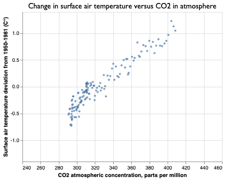

# nasa-climate-data


A simple example of an informal framework for an automated reproducible data pipeline, featuring NASA climate temperature and greenhouse gas data.

## How to use this repo

Take a peek at [the included "Visualizing" Jupyter notebook](notebooks/visualizing-global-temps-and-co2-levels.ipynb) to see how the "wrangled" [data file](data/wrangled/nasa-co2-temps.csv) is read and used to create charts like this:




All of the data for this project, including its intermediate stages (basically, [data/collated](data/collated)) is stored in this repo and viewable in the [data/](data/) directory.

However, you can re-run and repeat each of the data pipeline steps yourself using the included [Makefile](Makefile):

```sh
$ make stash
$ make collate
$ make wrangle
# or, just:
# $ make rerun 
```

Or you can execute each of the scripts explicitly:


```sh
$ ./src/stash_data.py
$ ./src/collate_data.py
$ ./src/wrangle_data.py
```

## What is with all these subdirectories and sub-steps?

This repo is meant to show off an informal way of organizing a datapipeline. I tentatively call it **stacowrap**, in reference to each step in the pipeline:

- **sta**shing: fetching and saving the data in its original "raw" form.

    [src/stash_data.sh](src/stash_data.sh) creates the data in [data/stashed/](data/stashed/)

- **co**llating:  the minimal amount of *lossless* work to organize the raw data files – anything from combining similarly structured files, to ["tidying" it Hadley Wickham style](https://vita.had.co.nz/papers/tidy-data.html) – and compile them into as few as well-structured CSV files as possible.

    [src/collate_data.py](src/collate_data.py) reads the `stashed/` data files and produces [data/collated/](data/collated/)

- **wra**ngling: [data/stashed/](data/stashed/) a catchall-term for the transformation work needed to turn the original data values into what is most needed for your end-use purpose, such as creating [visualizations](https://github.com/stacowrap/nasa-climate-data/blob/master/notebooks/visualizing-global-temps-and-co2-levels.ipynb) and/or piping into other applications, such as RStudio or spreadsheets.

    [src/wrangle_data.py](src/wrangle_data.py) reads the `collated/` data files and produces [data/wrangled/nasa-co2-temps.csv/](data/wrangled/nasa-co2-temps.csv), the only datafile – complete with self-evident header names and structure – needed by [this Jupyter notebook to produce useful charts](notebooks/visualizing-global-temps-and-co2-levels.ipynb)


## Why stacowrap

First, and most importantly: **naming things is hard**. This is why *organizing* data is *hard*, including figuring out which dataset derived from another. And even, which data file contains the *original data* -- an extremely important thing to not fuck up in journalism, when you're challenged to prove that errors came from the original source.

Second, thinking of data wrangling as discrete steps makes it much easier to design (and debug) programs that each do one thing and do one thing well. If you've ever struggled with creating and then debugging deeply nested conditional branches and loops in one giganto Jupyter Notebook or RStudio script, then you might find this mindset very refreshing. 


## (unfinished notes blah blah blah)


[Related and old Jupyter notebook](https://github.com/dannguyen/python-notebooks-data-wrangling/blob/master/Data-Extraction--NASA-Text.ipynb)


## stashing

NASA global surface air temperature anomaly data: 
    v3: 
        landing page: https://data.giss.nasa.gov/gistemp/index_v3.html
        url: http://data.giss.nasa.gov/gistemp/graphs_v3/Fig.A.txt

NASA Global Mean CO2 Mixing Ratios Observations: 
    - url: https://data.giss.nasa.gov/modelforce/ghgases/Fig1A.ext.txt
    - landing page: https://data.giss.nasa.gov/modelforce/ghgases/

NASA CO2 measurements:
    - url: ftp://aftp.cmdl.noaa.gov/products/trends/co2/co2_mm_mlo.txt
    - landing page: https://climate.nasa.gov/vital-signs/carbon-dioxide/
    - alt: ftp://aftp.cmdl.noaa.gov/products/trends/co2/
    - ftp://aftp.cmdl.noaa.gov/products/trends/co2/co2_mm_mlo.csv is stored in data/misc


Misc:

    v4: Global Annual Mean Surface Air Temperature Change
        landing page: https://data.giss.nasa.gov/gistemp/
        subpage: https://data.giss.nasa.gov/gistemp/graphs_v4/
        url: https://data.giss.nasa.gov/gistemp/graphs_v4/graph_data/Global_Mean_Estimates_based_on_Land_and_Ocean_Data/graph.txt
